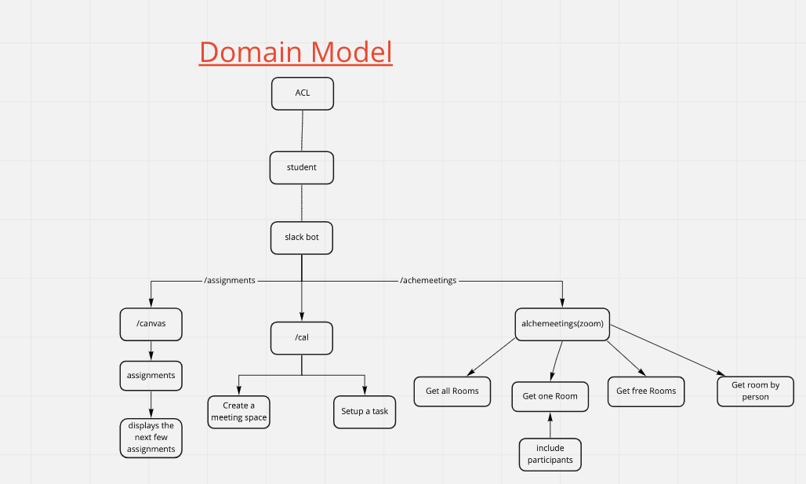

# Awesome-Bot
A slack bot that can:
  - provide users information on zoom rooms in alchemeetings
  - add/retrieve their to-do list from a database
  - retrieve assignment info from canvas (maybe)


# Group Members
  - Edmond Zhan
  - Jake Thrasher
  - Colin Bassett
  - Parker Sequeira
  
## user stories
```
User #1: Need Zoom Rooms
User Story: As an Alchemy student, I want to have access to Alchemy's Zoom Rooms so that I can join them through Slack.
Feature Tasks:
  - User can use a slash command on Slack bot
  - Show all the rooms as a response
  - Each room will display a name, id, and url
  - User can click on the link to join the room
Acceptance Task: 
  - Make sure that the information for each room is accurate
  - Make sure the link takes you to the right room
  - Only call to the API once
  - Only send a single message in Slack with all the rooms
```
```
User #2: Need a single Zoom Room with it's participants
User Story: As an Alchemy student, I want to see who's in the room before I join.
Feature Tasks:
  - User can use a slash command on Slack bot
  - Shows a single room with it's participants as a response
  - The response provides a name, url, and all the users in that room
  - User can click on the link to join
Acceptance Task: 
  - Make sure response is accurate
  - Make sure it links to the right room
  - Differentiate it from other zoom features
```
```
User #3: Canvas Student
User Story: As an Alchemy student who uses Canvas, I want access to the Canvas assignments on Slack.
Feature Tasks:
  - User can use a slash command 
  - Response shows a list of the next few assignments that are due
  - Each assignment has a name, due date, and a url to the assignment
  - User can click on the link to access the assignment's page
Acceptance Task: 
  - Ensure the info and link are accurate
  - Response is sent as a single message
```
```
User #4: Need to make a private call 
User Story: As an Slack user, I want to be able to set up a meeting on slack so that I can talk to fellow users.
Feature Tasks:
  - User can use a slash command
  - Bot will ping the target(s)
  - Response will make a room on Slack between the users with date, time, and topic
Acceptance Task: 
  - Ensure the response is sent to the right person
  - Uses the calling feature on Slack
```
```
User #5: Need info about an npm package
User Story: As a software developer, I want to search for an npm package so that I can quickly see what's available and what it does.
Feature Tasks:
  - User can use a slash command
  - Response provides the first few results of a search on https://www.npmjs.com/
  - Results show the name, basic info, and a url to the package
  - User can click on link to the url
Acceptance Task: 
  - Ensure the bot can web-scrap from the npmjs site
  - Information and link are accurate
  - Only show the first 3 results
  - All 3 results are sent as a single message from the bot
```
## Domain Modeling


## Database Entity-Relationship-Diagram

## Slack Permissions and Dependancies

